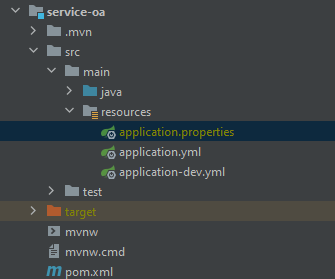

# Configuration

Create a file called `application.properties` in the resources under `service-oa` module.

`application.properties`: write your database information in this file.



```properties
datasource.url=jdbc:mysql://ipAddress:portNumber/databaseName?serverTimezone=GMT%2B8&useSSL=false&characterEncoding=utf-8 
# example: jdbc:mysql://localhost:3306/jielim-office?serverTimezone=GMT%2B8&useSSL=false&characterEncoding=utf-8
datasource.username=yourDatabaseUsername
datasource.password=youDatabasePassword
```
