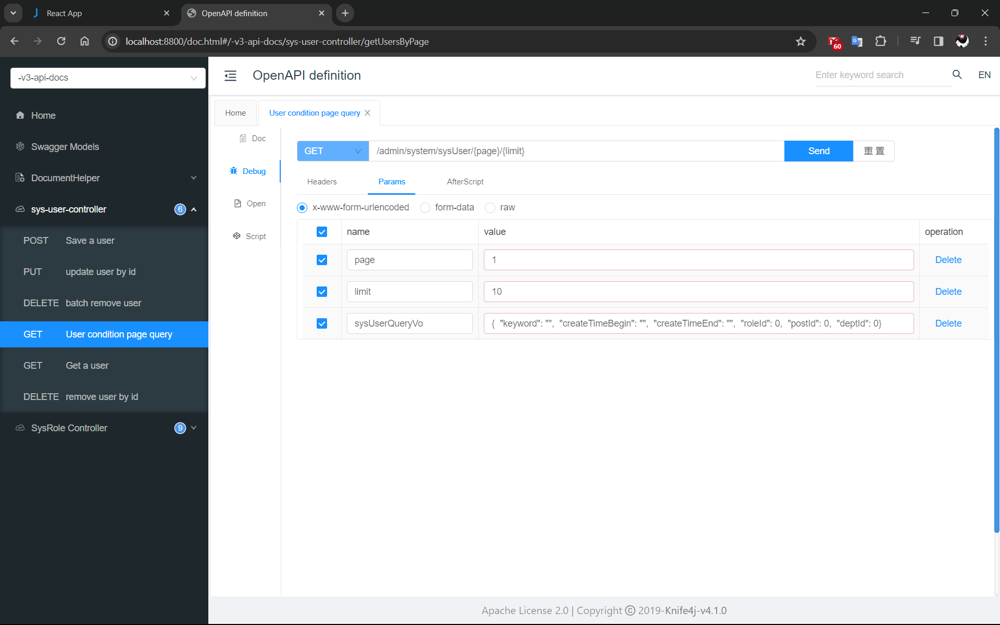
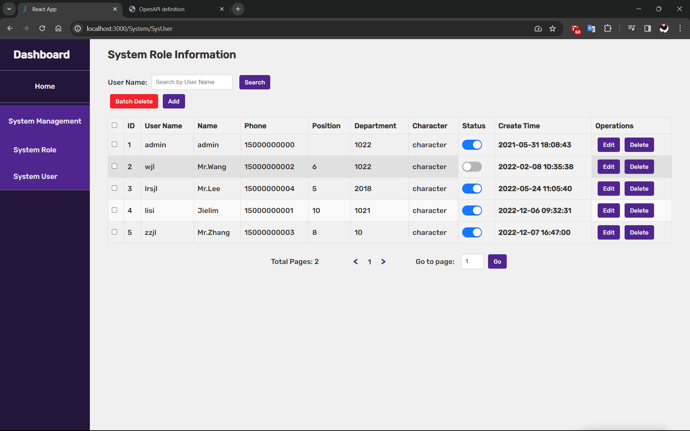
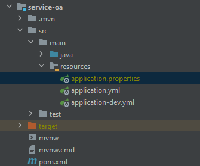

# Introduction
Note: This is a project with the purpose of learning (Still under development).

This is a **office management system** that provides a backend administrator system and an employee system.

**Admin Side:** permission management, approval management, menu management.

**Employee side:** office approval, user auth/login, and send message.

> [Go Backend Repository](https://github.com/jielim36/jielim-office-backend)

> [Go Frontend Repository](https://github.com/jielim36/jielim-office-frontend)

---

# Tech Stack
**Backend:** SpringBoot, MyBatisPlus, SpringSecurity, Redis, and MySQL.

**Frontend ([Go frontend Repo](https://github.com/jielim36/jielim-office-frontend)):** React.js, Antd UI Library, and Axios.

---

### Knife4j API Test
Utilize [Knife4j](https://doc.xiaominfo.com/docs/quick-start) (Integration with Swagger2 and OpenAPI3) to simplify API development for users, teams, and enterprises.
You may access the URL: `http://localhost:8800/doc.html` to visit the API testing page.


### Admin Side
Still under development...


#### Employee Side
Still under development...


# Configuration

Create a file called `application.properties` in the resources under `service-oa` module.

`application.properties`: write your database information in this file.



```properties
datasource.url=jdbc:mysql://ipAddress:portNumber/databaseName?serverTimezone=GMT%2B8&useSSL=false&characterEncoding=utf-8 
# example: jdbc:mysql://localhost:3306/jielim-office?serverTimezone=GMT%2B8&useSSL=false&characterEncoding=utf-8
datasource.username=yourDatabaseUsername
datasource.password=youDatabasePassword
```
